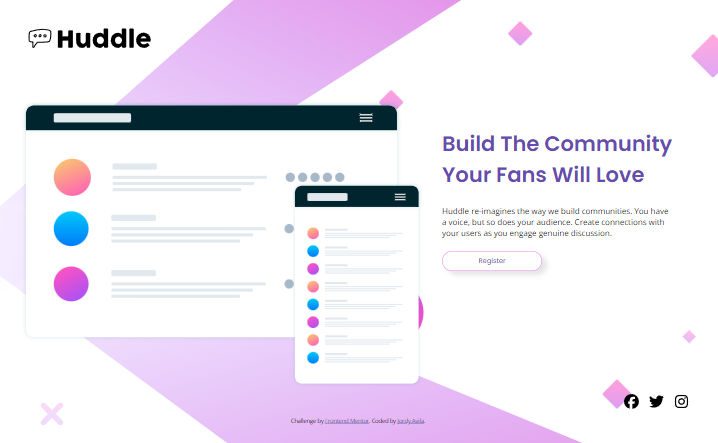

This is a design layout for the [Huddle landing page with single introductory section challenge on Frontend Mentor] i did it applying my knowledge in html and css, this proyect could finish with all the interactive part of the frontend develop, but i'm actually learning about styles and i decided to let it like this. I will do it soon!

## Table of contents

- [Overview](#overview)
  - [Screenshot](#screenshot)
- [My process](#my-process)
  - [Built with](#built-with)
  - [What I learned](#what-i-learned)
  - [Continued development](#continued-development)
- [Author](#author)

### Screenshots

## My process

This proyect was a good practice for enhance my skills in the code and make more stronger css and html "language", i did it using advanced things and appliying the responsive designed that i learned in the course in platzi , i help myself visiting the oficial documentation of html and css too.
### Built with

- Semantic HTML5 markup
- CSS custom properties
- Flexbox

### What I learned

I've learned a lot about positions and the use of grid instead flexbox in css, how to order the elements,etc. I'm so proud of my growth in this little challenge

I've learned how to manage the space in the display, focusing in the responsive designed, something that i learned too is Mobile-first workflow, practice make me better and i'm happy for what i'm doing.

### Continued development

I would like to continue with my learning, focusing on the use of box design, flexbox, and grid, to create great designs based on these basic concepts. I aspire to become a skilled front-end developer, and this is my path.

## Author

- Linkdin - [Jordy Avila](https://www.linkedin.com/in/jordy-avila-706852251/)
- Frontend Mentor - [@Jordy01090](https://www.frontendmentor.io/profile/Jordy01090)